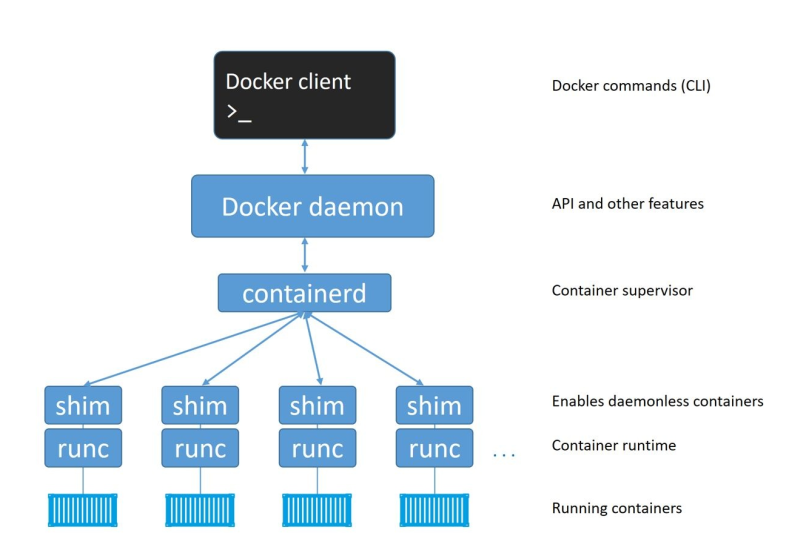
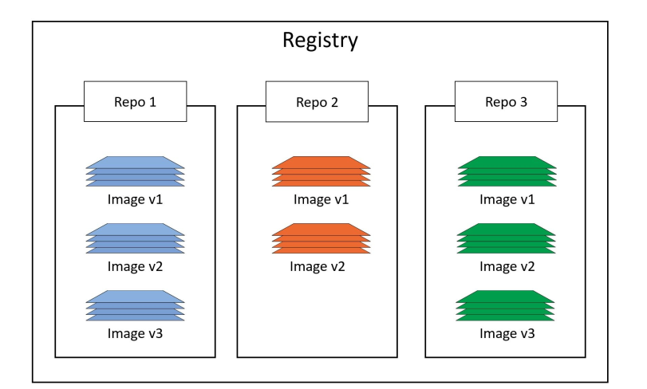

## Docker for beginners

Consider your life without Docker and VMware
Each time a business needed a new application new server had to be bought
VMWare changed the world. But each VM had its own OS ( that itself needs maintenance) that required CPU and RAM that would have consumed by an application instead.VMs are slow to boot and portability isn’t great - migrating and moving VMs were also a big problem

Containers to the rescue

running container uses the kernel of the host
machine it is running on. Windows containers require a Windows Host,
and Linux containers require a Linux host

A general overview of docker architecture is :



docker gives docker client and docker daemon
`docker version` will request the engine for response
Docker image is effectively a  stopped container
`docker image ls`

If you have an image pulled in 
`docker container run -it ubuntu:latest bash`

attach your shell to any running container

`docker exec -it container_name bash`

from a dockerfile to create an image

`docker image build -t test:latest .`


run container from built image
```
docker container run -d \
--name web1 \
-p 8080:8080 \
test:latest

```

Once the daemon receives the command to create a new container (REST api call by docker client), it makes a call to containerd. daemon does not contain any code to create containers.
The daemon communicates with containerd. containerd cannot actually create containers. It uses runc to do that. It converts the required Docker image into an OCI bundle and tells runc to use this to create a new container. runc interfaces with the OS kernel to pull together all of the constructs necessary to create a container (in Linux these include namespaces and cgroups). The container process is started as a child-process of runc, and as soon as it is started runc will exit.

## Images

Images are made up of multiple layers that get stacked on top of each other and
represented as a single object

Once you’ve started a container from an image, the two constructs become dependent
on each other and you cannot delete the image until the last container using it
has been stopped and destroyed.

Windows images are larger than linux ( alpine 2.7 MB)

`docker image pull alpine:latest`

### Build Context?
The build context is the set of files located at the specified PATH or URL. Those files are sent to the Docker daemon during the build so it can use them in the filesystem of the image.
Make sure that the build context only contains the files and folders it really needs.
In a project where source code is handled by Git, we use a `.gitignore file` to make sure private data is kept locally and not sent out to GitHub/GitLab/BitBucket/etc.
The same thing applies during the build phase of a Docker image as the daemon uses a `.dockerignore` file to filter out the files and folders that should not be taken into account in the build context.

Docker images are stored in image registries. The most common registry is
Docker Hub (https://hub.docker.com). Here is a structure of a common registry. 

### Images with multiple tags
docker image pull -a <repository-name>

### Inspecting an Image details ( layers )
docker image inspect ubuntu:latest

### Sharing image layers
Multiple images can, and do, share layers. This leads to efficiencies in space and
performance